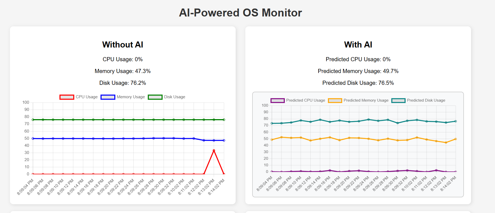
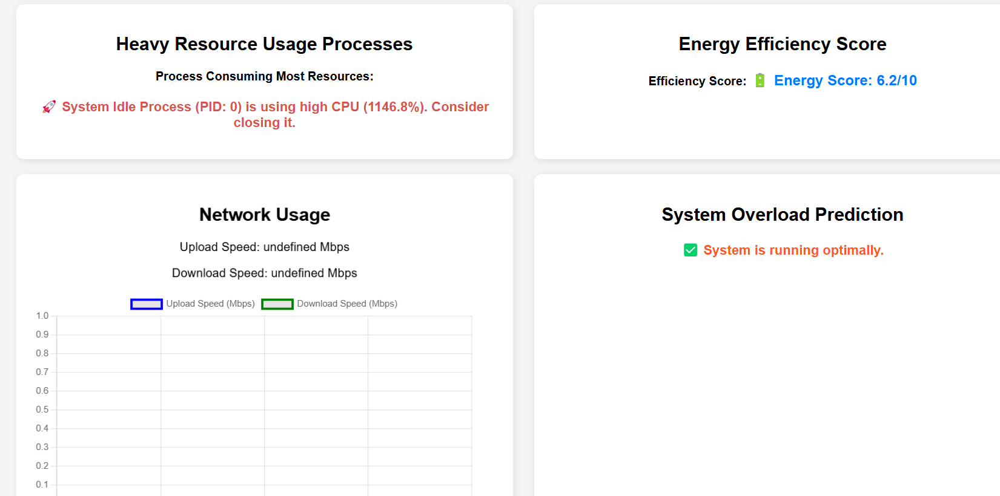

AI-Powered OS Monitor
This is a simple yet powerful OS monitoring tool that gives real-time insights into system performance. With AI-powered predictions, it helps you track CPU, memory, disk, and network usage while also detecting potential system issues.
:- Features
1.Live system monitoring – See real-time CPU, memory, disk, and network usage.

2.AI-powered predictions – Get forecasts on system performance and possible overload.

3.Anomaly detection – Detect heavy resource usage and get optimization suggestions.

4.Network speed tracking – Monitor upload and download speeds in real time.

5.System uptime & performance trends – Understand how long your system has been running and its performance stability.

6.Power consumption estimation – Get an idea of how much power your system is consuming.

:-How to Set Up
1️.Clone the Repository
First, grab a copy of the project by running:
git clone https://github.com/your-username/AIPoweredOSMonitor.git
cd AIPoweredOSMonitor

2️.Install Dependencies
Make sure Python is installed, then install the required libraries:
pip install flask psutil

3️.Run the Application
Launch the system monitor with:
python ai_os_monitor.py
Then open your browser and go to http://127.0.0.1:5000/ to see it in action! 🚀

:-Screenshot

